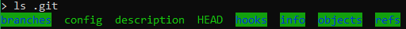
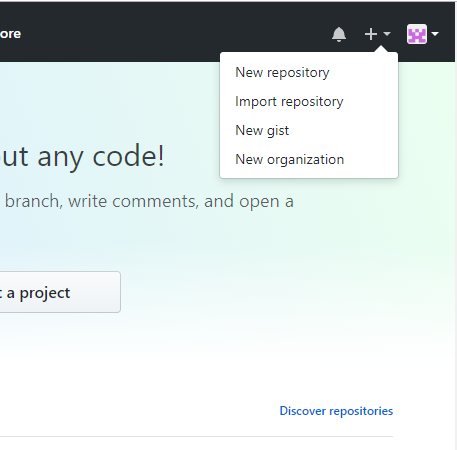
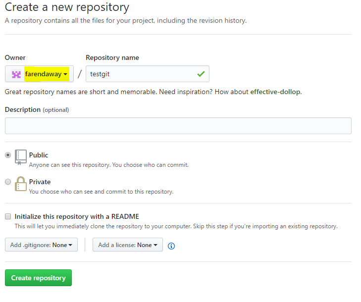
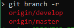

## Control de versiones
Sistema de control de versiones que permite tener control de los cambios
y como estos son realizados


## Git 
Es un software de control de versiones diseñado por Linus Torvalds. Su propósito es llevar registro de los cambios en archivos de computadora y coordinar el trabajo que varias personas realizan sobre archivos compartidos.

## Ejercicio
Crearemos un proyecto desde cero, llevaremos el proyecto bajo un control de sus versiones con git

## Agenda
* Crear nuestra cuenta en github
* Crear repositorio con controlador de versiones
* Agregar contenido inicial
* Agregar nuestras credenciales
* Commit de los cambios
* Crear repo en github y subirlos
* Crear la rama develop
* Crear una rama para los primeros cambios
* Hacer merge de la rama de develop  y subir los cambios
* Hacer merge a master y crear tag
* Fork todo-app en la máquina virtual

### Crear nuestra cuenta en github
```
Ir a https://github.com
```
### Crear repositorio con controlador de versiones
Abrimos una terminal
```
cd ~
mkdir testgit
cd testgit
git init
```
Con esto se ha inicializado el folder como un proyecto que sera versionado con git y podremos 
controlarlo de manera local, git crea un folder con meta informacion acerca de la estructura del proyecto, sus cambios.
```
ls .git
```

### Agregar contenido inicial
Crearemos el archivo default que es recomendable en los proyectos de git
```
touch README.md
code README.md

# Agregar contenido
```

### Agregar nuestras credenciales de github
```
git config --global user.email <yourmail@service.com>
git config --global user.name <youruser>

git config user.email
#mostrar tu correo

git config credential.helper store
#para guardar las credenciales
```
### Commit de los cambios
```
# para agregar todos nuestros archivos
git status
git add .
git commit -m "Primer commit"
git status
git log
```

### Crear repo en github y subirlos
```
Ir http://www.github.com/<tucuenta>
```

___

### Crear la rama develop
___
Github nos dará una guía
```
git remote add origin https://github.com/<<usuario>>/testgit.git
git push -u origin master
```

### Crear la rama develop
```
git checkout -b develop
git push origin develop

# opcional
git branch -r
```

### Crear una rama para los primeros cambios
```
git checkout develop
git checkout -b feature/c1
```
Agregaremos contenido 
```
touch C1.txt
# Agreguen el contenido que deseen
```
Guardaremos los cambios en el repo
```
git status
git add .
git commit -m "feature/c1 Agregando archivo c1.txt"
git push origin feature/c1

# opcional
git branch -r
```
### Hacer merge a rama de develop  y subir los cambios
```
git checkout develop
git merge feature/c1
git push origin develop

#opcional
git log
```

### Hacer merge a master y crear tag
```
git checkout master
git merge develop
git tag 1.0.0
git push origin master
git push origin 1.0.0

# ir a https://github.com/<<usuario>>
```