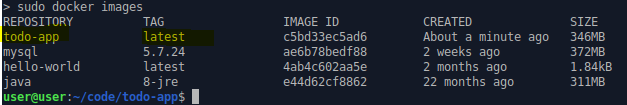
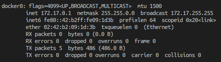

# Comandos varios crear la imagen de docker

## Construir ejecutable de java
`mvn clean package`
El  ejecutable se crea en la carpeta target/todo-app.jar

##Dockerfile
Permite especificar que es lo que tendrá la imagen de docker

```
FROM java:8-jre

LABEL maintainers="Jorge Alvarez <alvarez.jeap@gmail.com>"

WORKDIR /opt/apps/todo-app

COPY ./target/todo-app.jar ./todo-app.jar

ENV PORT 8080

EXPOSE $PORT

RUN useradd -m todo-app

USER todo-app

CMD ["java", "-jar", "-Xms128m", "-Xmx128m", "/opt/apps/todo-app/todo-app.jar"]
```

## Hacemos build de la aplicación
Nos ubicamos en la carpeta de nuestro proyecto
```
$ docker build -t todo-app -f docker/Dockerfile .
```
La bandera -t indica el nombre de la imagen que se va construir, -f es para especificar la ruta del archivo Dockerfile

Podemos ver ahora nuestra imagen con el comando `docker images`



## Ejecutar la imagen
Para probar nuestra aplicación por medio de un contenedor utilizaremos docker-compose, creamos en la carpeta prinicipal del proyecto el archivo `docker-compose.yml` y le adjuntamos el contenido:
```
version: '3.3'

services:

  todo:
    image: todo-app:latest
    ports:
      - "8080:8080"
    extra_hosts:
      - mysql:172.18.0.1
```
la ip `172.18.0.1` puede variar dependiendo de cada computadora, ejecutemos el comando `ifconfig` para averiguarlo

Ejecutamos la aplicación
```
docker-compose up
```

Para poder acceder desde la web necesitamos saber nuestra ip de docker utilizamos el comando `ifconfig` y buscamos la interfaz de docker


Y podemos acceder en el navegador por la ruta dependiendo de la ip

```
http://172.17.0.1:8080
```