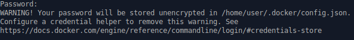
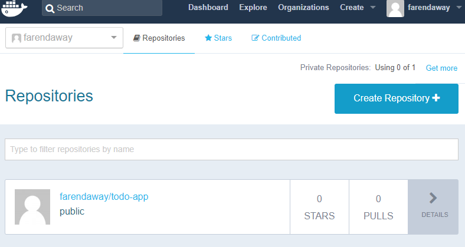

# Pasos para crear subir una imagen a un repositorio (Dockerhub)

## Crear cuenta Dockerhub
Debemos ir al sitio https://hub.docker.com/ 
___

___

Debemos validar el correo para poder acceder sin problemas
___

___

## Hacer login
```
sudo apt install gnupg2 pass
#posibles problemas ubuntu 18.04

docker login -u myAwesomeUser
```
___

___

Una vez con nuestras credenciales en orden podemos crear una tag para subirla al repositorio

```
#crear tag
docker tag todo-app:latest farendaway/todo-app:0.0.1

#subir tag
docker push farendaway/todo-app:0.0.1
```
Luego podemos ir al sitio de dockerhub para nuestra cuenta y veremos la imagen
___

___