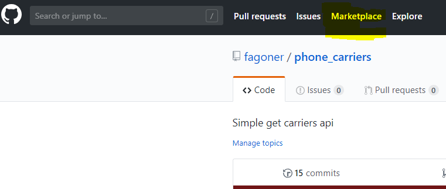
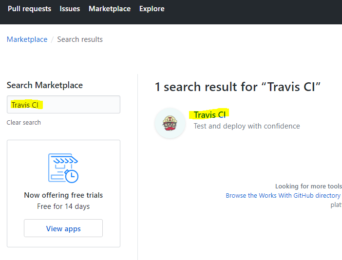
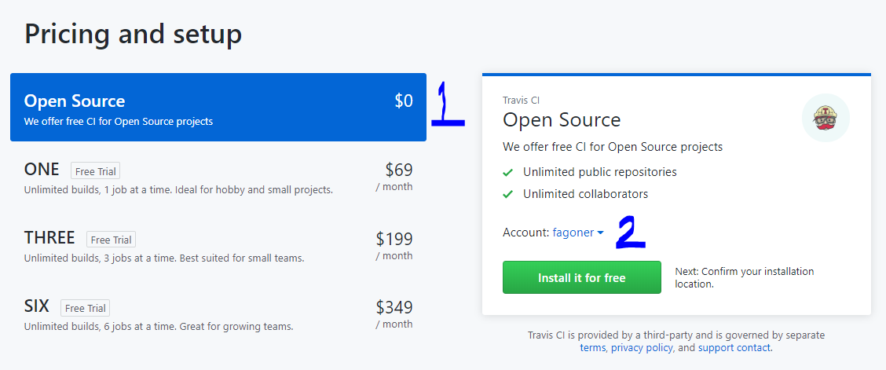
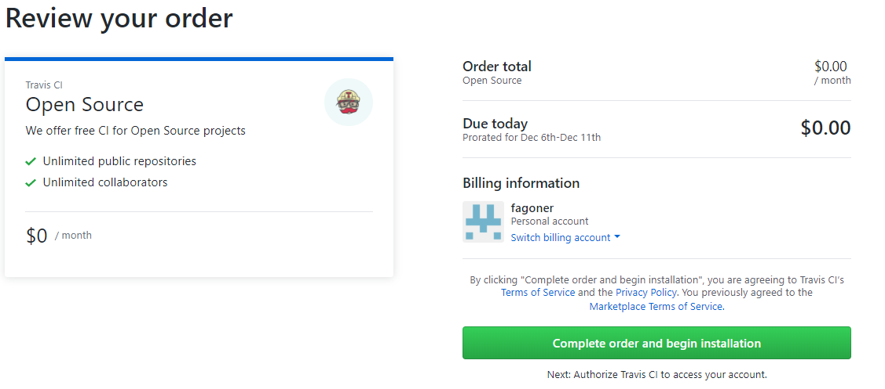
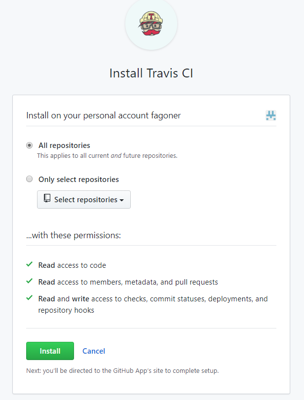
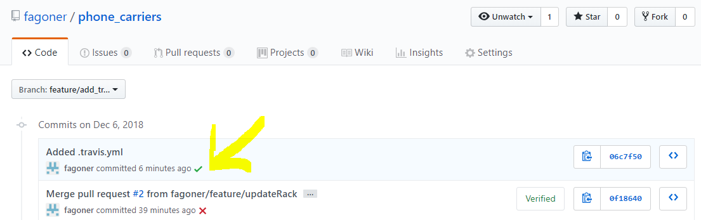

# Pasos para hacer set de Travis CI

## Github
Ya que tenemos nuestra cuenta en github buscamos el servicio en Marketplace


____
## Activar servicio
Seleccionar la opción de Travis


#### 1. Es el tipo de servicio 
#### 2. La cuenta de github o proyecto al alcance
Y seleccionar `Install it for free`


____
## Seleccionar proyectos
Podemos escoger un/todos los proyectos de la cuenta  y procedemos a instalar

___

# Agregando un proyecto

Para poder comenzar a utilizar el proyecto, es necesario crear un archivo en nuestro proyecto, el archivo `.travis.yml`, con este se le indica a travis-ci como debe procesar el proyecto

```
git branch develop
git checkout -b feature/add_travis
touch .travis.yml
```
El contenido cambia de acuerdo al proyecto, pueden ver el proyecto: [fagoner/phone_carriers](https://github.com/fagoner/phone_carriers)

Contenido de `.travis.yml`
```

language: ruby
rvm: 2.2
script:
script: bundle exec rspec
```    

Una vez creado el archivo es necesario hacer commit de los cambios
```
git add .
git commit -m ".travis.yml agregado para CI/CD"
git push origin feature/add_travis
```

Si todo esta correcto veremos en la tab de commits de la nueva rama que travis comenzará 
a ejecutar el job


