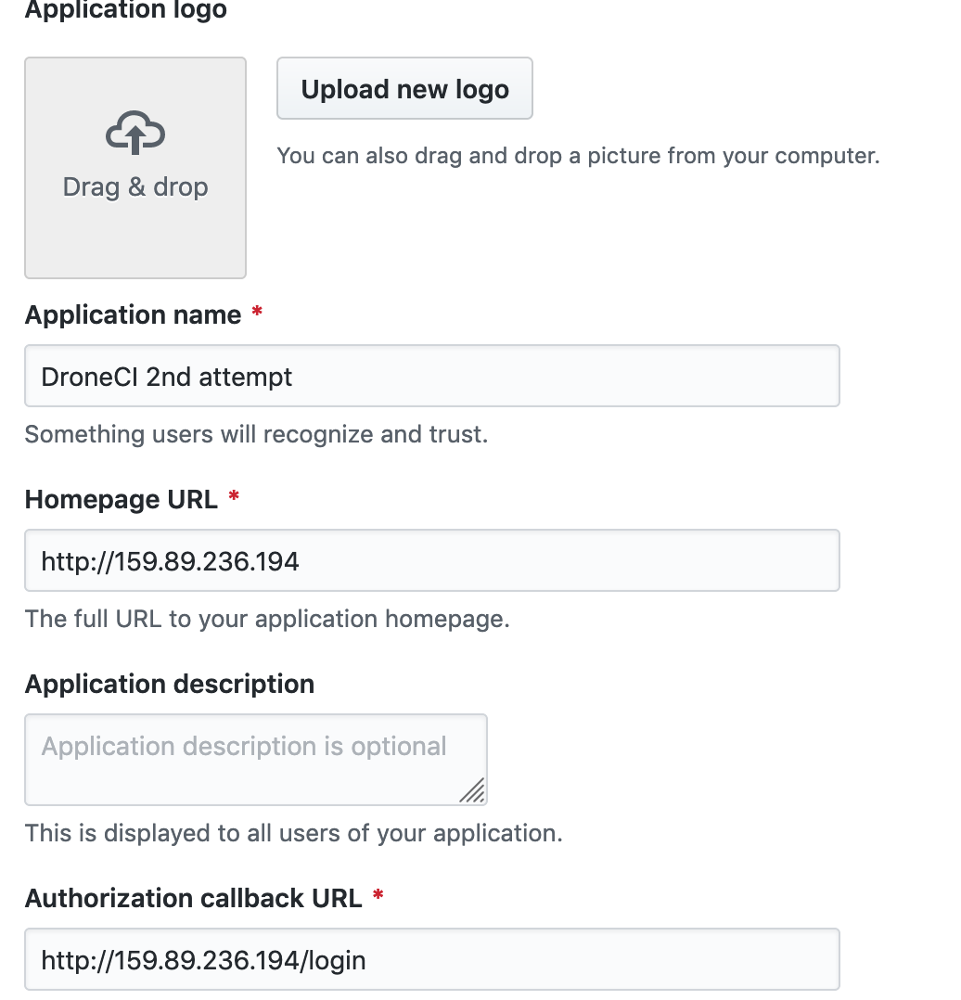
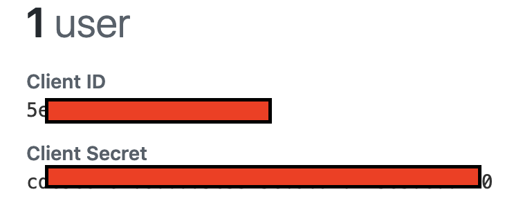
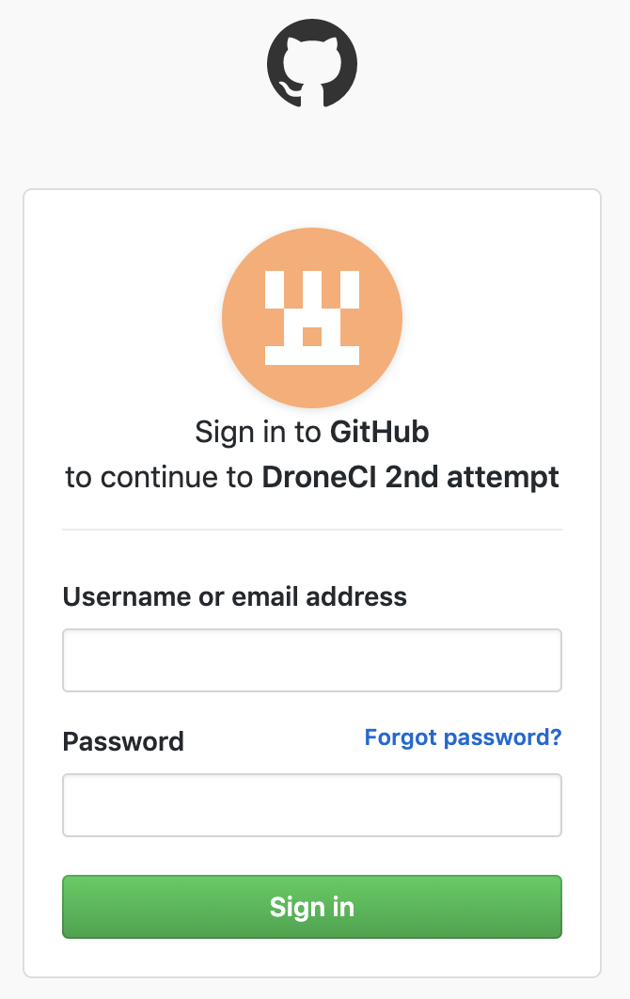

# HOW TO INSTALL

## Source 
Go to your Repository
* Homepage URL: http://192.168.99.1
* Authorization callback URL: http://192.168.99.1

---

***


* Generate a secret
```
$ openssl rand -hex 16
bea26a2221fd8090ea38720fc445eca6

#OR

LC_ALL=C </dev/urandom tr -dc A-Za-z0-9 | head -c 65 && echo
```
***
### Server

```
docker run \
  --volume=/var/lib/drone:/data \
  --env=DRONE_AGENTS_ENABLED=true \
  --env=DRONE_GITHUB_SERVER=https://github.com \
  --env=DRONE_GITHUB_CLIENT_ID=1234 \
  --env=DRONE_GITHUB_CLIENT_SECRET=a12vd \
  --env=DRONE_RPC_SECRET=1212121121212 \
  --env=DRONE_SERVER_HOST=host \
  --env=DRONE_SERVER_PROTO=http \
  --env=DRONE_TLS_AUTOCERT=false\
  --publish=80:80 \
  --publish=443:443 \
  --restart=always \
  --detach=true \
  --name=drone \
  drone/drone:1
```

### Agent
```
docker run -d \
  -v /var/run/docker.sock:/var/run/docker.sock \
  -e DRONE_RPC_PROTO=http \
  -e DRONE_RPC_HOST=theHost \
  -e DRONE_RPC_SECRET=1212312 \
  -e DRONE_RUNNER_CAPACITY=2 \
  -e DRONE_RUNNER_NAME=${HOSTNAME} \
  -p 3000:3000 \
  --restart always \
  --name runner \
  drone/agent:1
```
---
### Login
http://192.168.99.1
---

***

